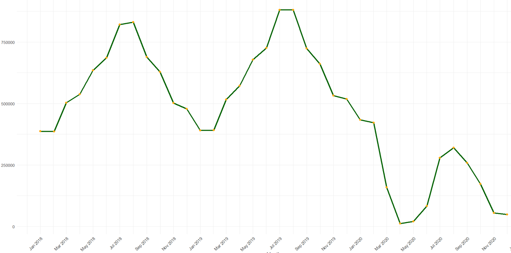
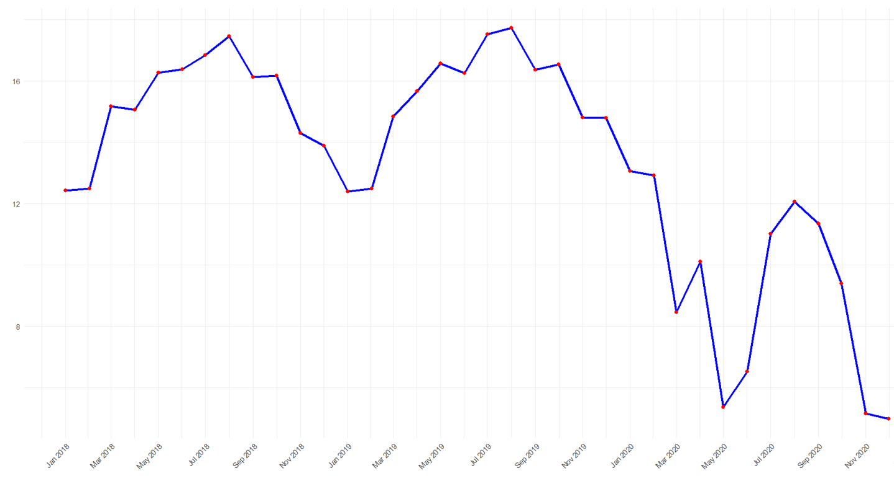
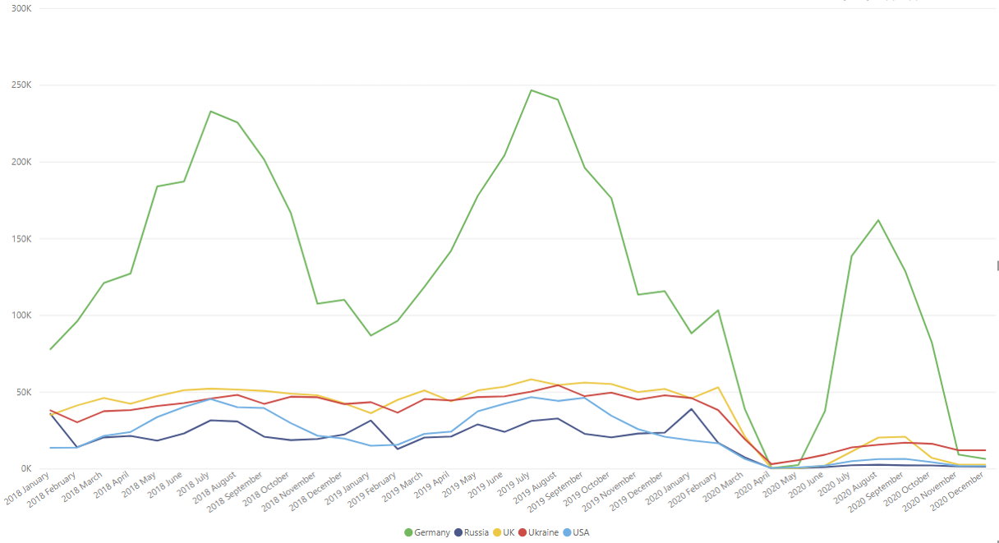
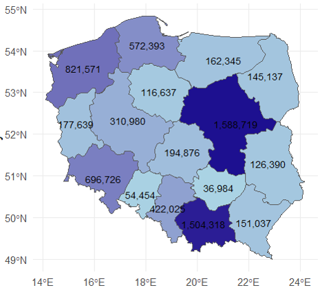
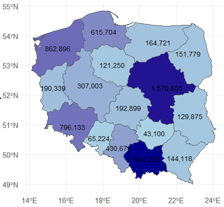
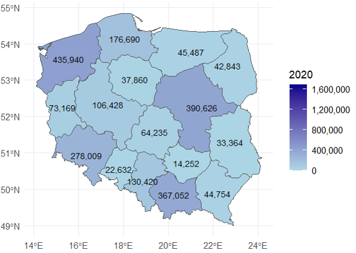
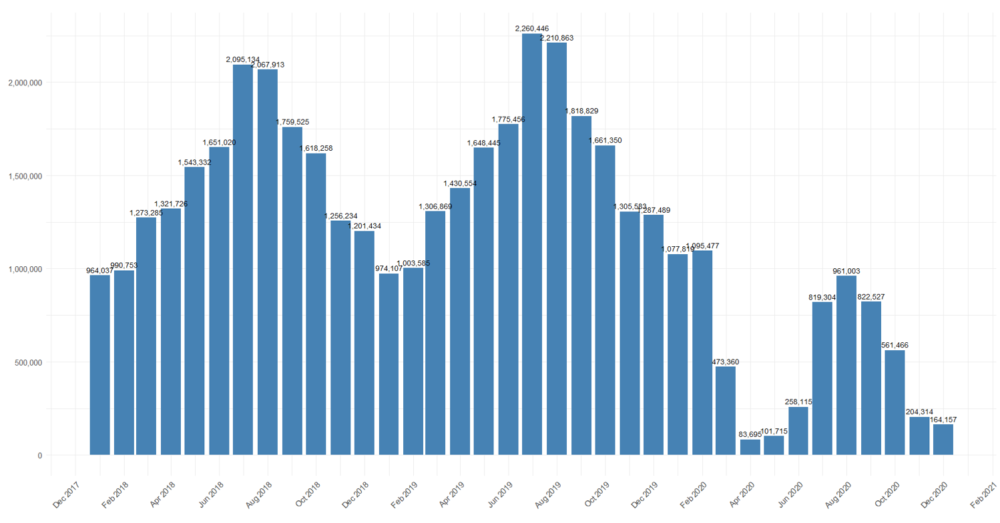
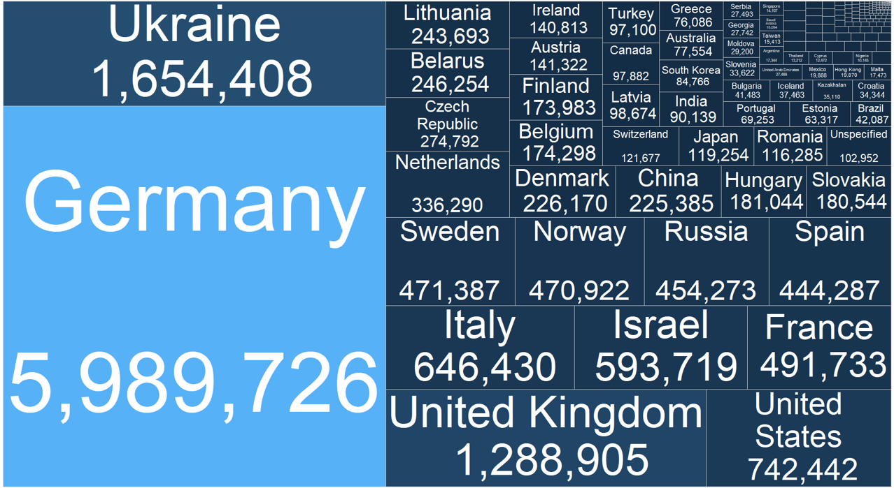
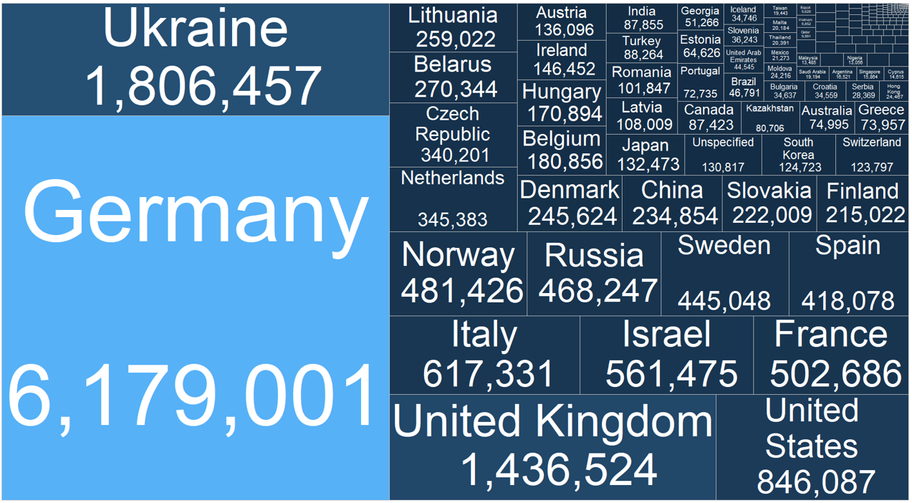
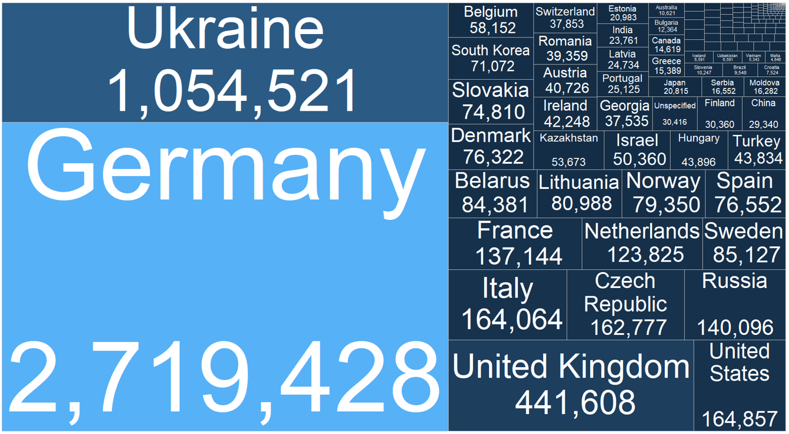

# WP9_S2_PL

***Pilot study for imputation - accommodation establishments***

The repository consist a use case regarding the imputation of the number of foreign tourists in relation to their country of origin. 5 countries with the highest number of foreign tourists were chosen.

{width="131"}

***Pilot study for imputation - accommodation establishments EDA***

**Accommodation establishments**

Tourist accommodation establishments regardless of the type, owner, and location, as well as establishments with other purposes (not related to tourism) that are temporarily used by tourists (e.g., student dormitories, sports and recreation centers).

Tourist accommodation establishments classified into the following activity groups according to NACE Rev. 2 classification:

-   55.1 -- hotels and similar accommodation,

-   55.2 -- holiday and other short-stay accommodation,

-   55.3 -- camping grounds, recreational vehicle parks and trailer parks. The study covers 20 types of tourist accommodation establishments.

**Survey**

KT-1: Report on the occupancy of tourist accommodation establishments:

-   Mandatory monthly survey of accommodation establishments with 10 or more bed-places.

-   Census survey of 14,859 establishments.

-   The deadline for submitting reports is the 10th day after the reporting month. In practice, establishments report throughout the entire month.

-   Unit response rate is approximately 80% and varies due to seasonality.

-   Item non-response pertains mostly to foreign tourist data.

**Data**

Range of collected data

-   Establishment name, type, address and category of establishment

-   Months of operation

-   Rooms and bed places

-   Occupancy (tourists and nights spent) during the surveyed month

-   Occupancy (tourists and nights spent) by foreign tourists with respect to country of residence

-   Categorical and count data

## Results from EDA

**Total number of foreign tourists**

**Average number of foreign tourists per one establishment**

**Total numer of tourists for top 5 most visiting coutries**

**Total number of foreign tourists by voivodeships**

*2018*

*2019*

*2020*

**Overnight stays of foreign tourists**

**Number of overnight stays by foreign tourists by country of origin in 2018**

**Number of overnight stays by foreign tourists by country of origin in 2019**

**Number of overnight stays by foreign tourists by country of origin in 2020**

